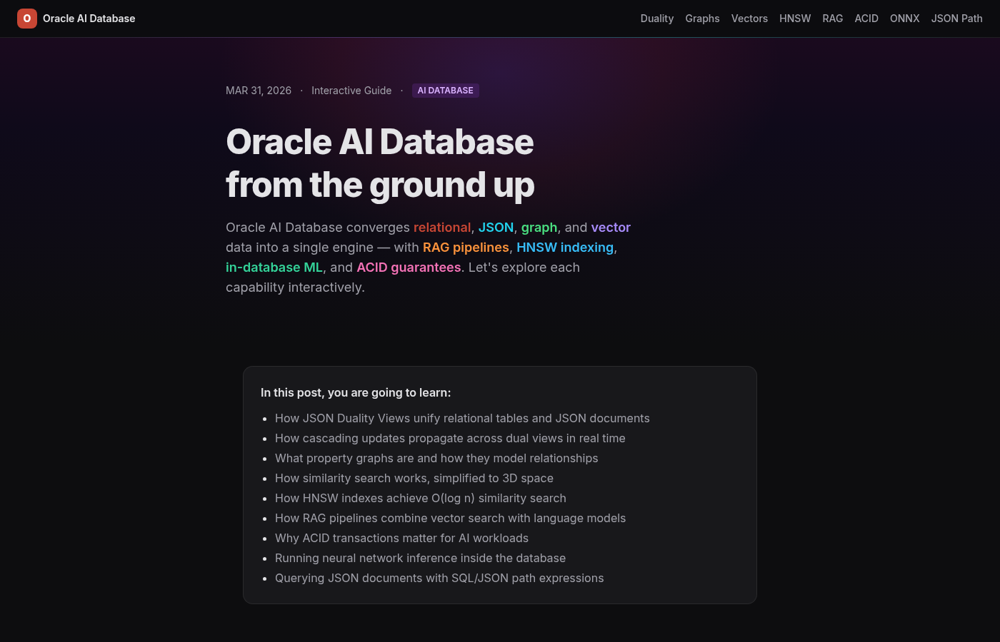
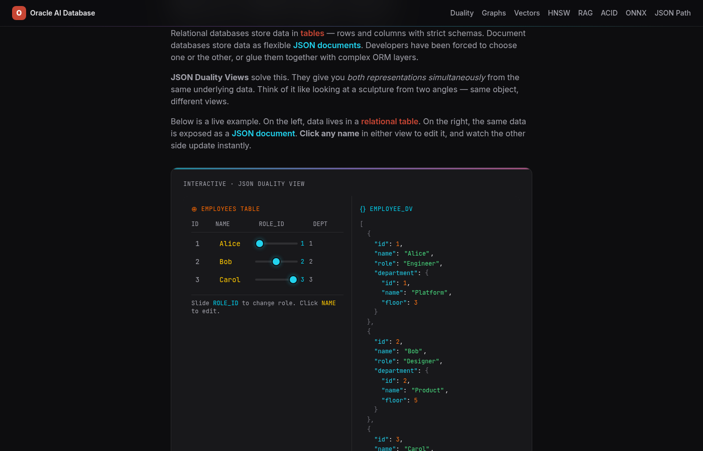
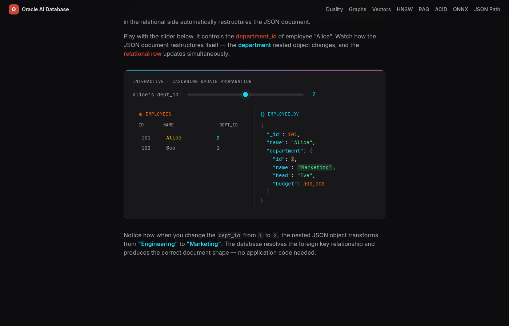
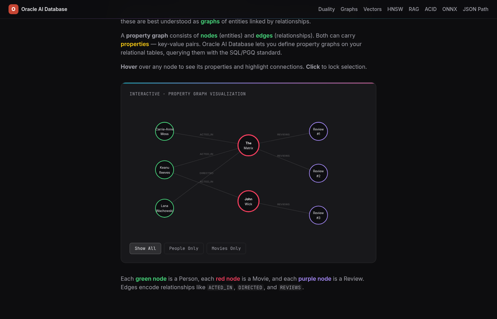
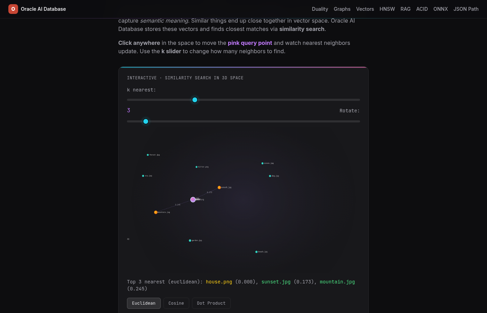
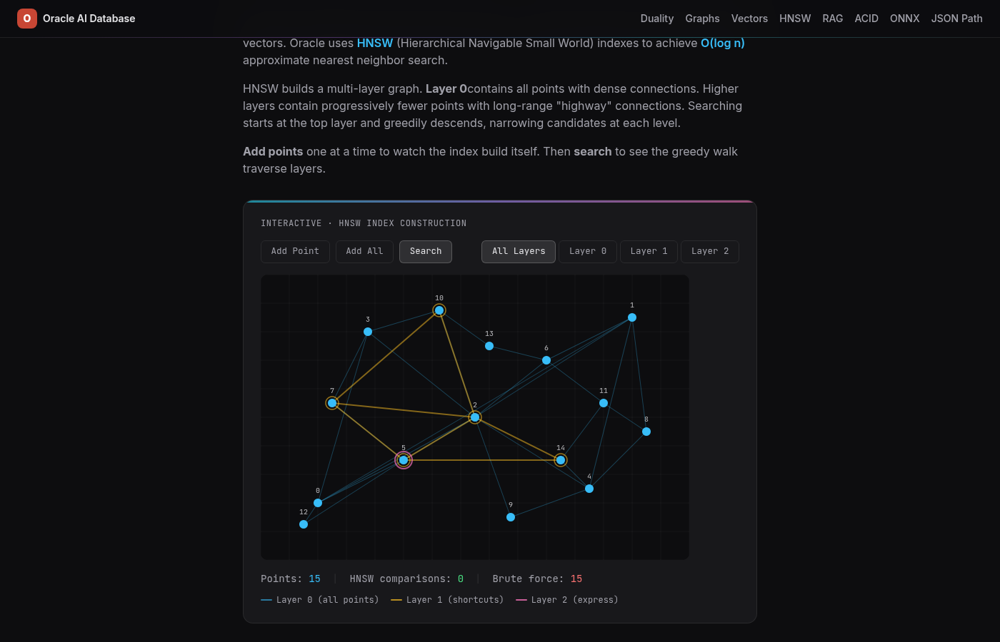
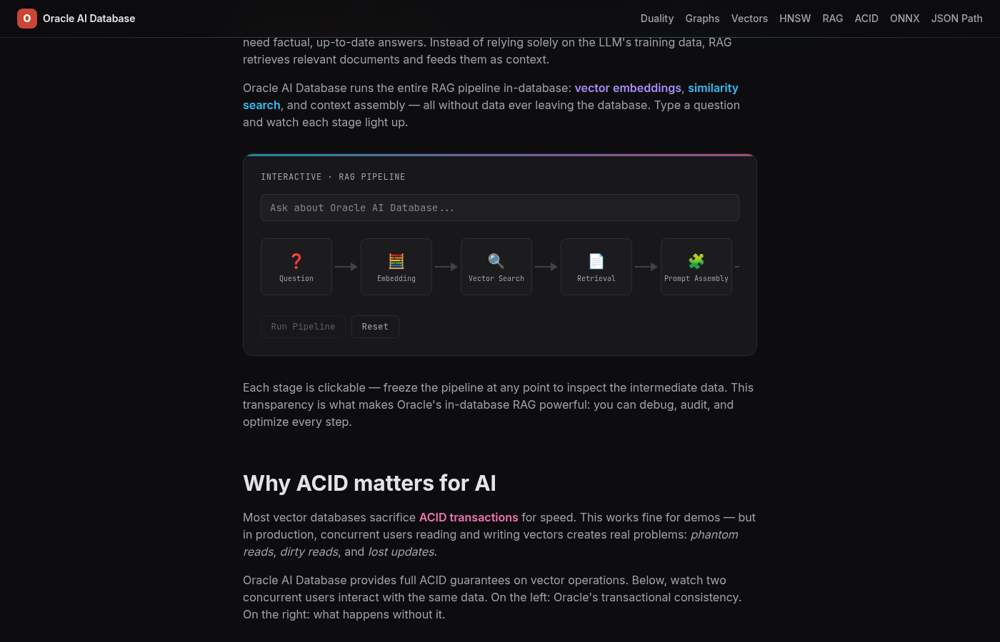
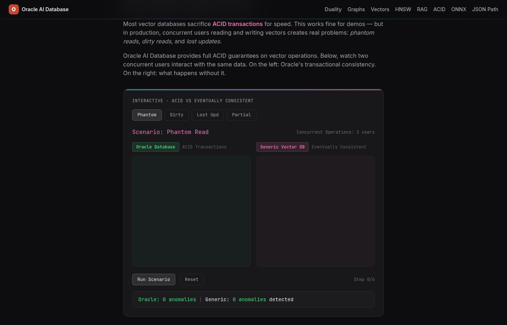
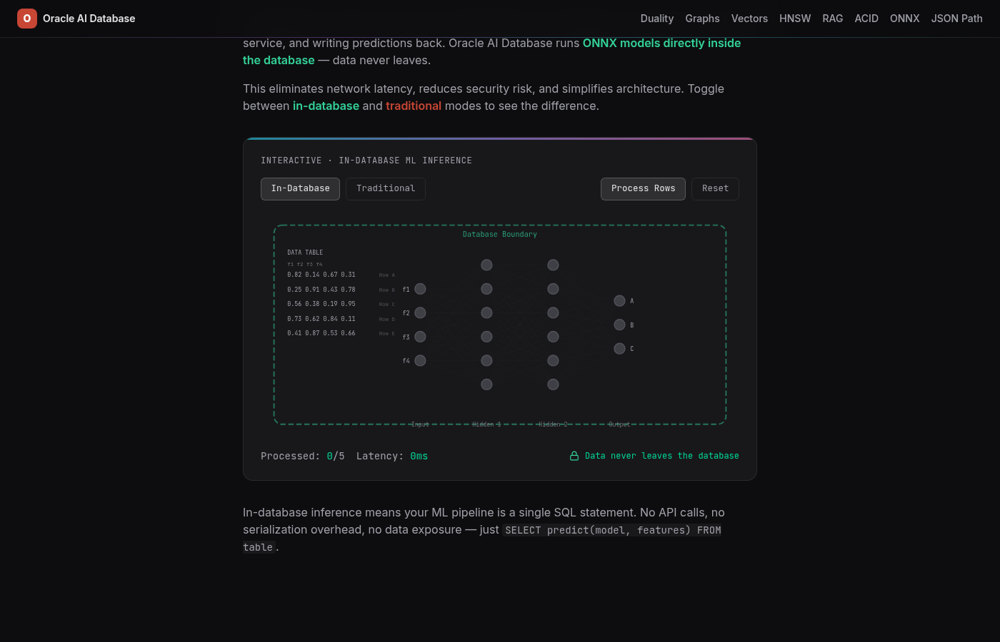
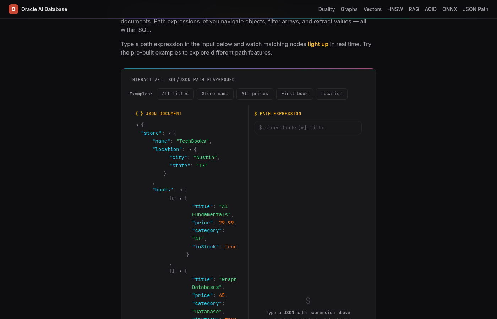

# Oracle AI Database: From the Ground Up

An interactive showcase of Oracle Database 23ai features, built as a single-page static site. 9 hands-on widgets let you poke at the core capabilities: JSON Duality Views, property graphs, vector search, HNSW indexing, RAG pipelines, ACID transactions, in-database ML inference, and SQL/JSON path queries.

**[Live Demo](https://jasperan.github.io/visual-oracledb/)**



## What's Inside

Oracle AI Database converges relational, JSON, graph, and vector data into a single engine. Each widget below visualizes one capability with interactive controls, so you can build intuition for how these features work under the hood.

### 1. JSON Duality Views

Relational databases store data in tables. Document databases store data as JSON. JSON Duality Views give you both representations simultaneously from the same underlying data.

The widget shows a relational table on the left and its JSON document equivalent on the right. Click any name to edit it, and watch the other side update instantly.



### 2. Cascading Updates

When data has relationships (foreign keys), updating one side of a duality view automatically restructures the other. A slider controls `department_id` for an employee. Drag it, and the nested JSON department object transforms in real time: the database resolves the foreign key and produces the correct document shape with zero application code.



### 3. Property Graphs

Some data is inherently about connections: social networks, supply chains, fraud rings. A property graph consists of nodes (entities) and edges (relationships), both carrying key-value properties. Oracle lets you define property graphs on relational tables and query them with SQL/PGQ.

Hover over any node to see its properties and highlight connections. Green nodes are people, red nodes are movies, purple nodes are reviews. Filter by type with the buttons at the bottom.



### 4. Vector Similarity Search

AI models convert text, images, and audio into vectors (arrays of numbers capturing semantic meaning). Similar things land close together in vector space. Oracle stores these vectors and finds closest matches via similarity search.

Click anywhere in the 3D space to move the pink query point and watch nearest neighbors update. Toggle between Euclidean, Cosine, and Dot Product distance metrics.



### 5. HNSW Index Construction

Brute-force similarity search checks every vector (O(n)), which doesn't scale. Oracle uses HNSW (Hierarchical Navigable Small World) indexes for O(log n) approximate nearest neighbor search.

HNSW builds a multi-layer graph. Layer 0 has all points with dense connections. Higher layers have progressively fewer points with long-range "highway" connections. Add points one at a time to watch the index build itself, then search to see the greedy walk traverse layers.



### 6. RAG Pipeline

Retrieval-Augmented Generation (RAG) is the go-to pattern for AI apps that need factual, up-to-date answers. Oracle runs the entire pipeline in-database: vector embeddings, similarity search, and context assembly, all without data leaving the database.

Type a question and watch each pipeline stage light up. Each stage is clickable, so you can freeze the pipeline and inspect intermediate data.



### 7. ACID Transactions

Most vector databases sacrifice ACID transactions for speed. That works for demos, but in production, concurrent reads and writes create phantom reads, dirty reads, and lost updates.

The widget runs 4 concurrency scenarios side by side: Oracle (ACID) on the left vs. a generic eventually-consistent vector DB on the right. Run each scenario to see the anomalies pile up on the non-transactional side.



### 8. In-Database ONNX Inference

Traditional ML inference means extracting data, shipping it to an external service, and writing predictions back. Oracle runs ONNX models directly inside the database. Data never leaves.

Toggle between in-database and traditional modes to compare latency. In-database inference collapses the whole pipeline into a single SQL statement: `SELECT predict(model, features) FROM table`.



### 9. SQL/JSON Path Playground

Oracle supports the SQL/JSON path language for querying nested JSON documents. Path expressions navigate objects, filter arrays, and extract values, all within SQL.

Type a path expression and watch matching nodes light up in real time. Try the pre-built examples (all titles, store name, all prices, first book, location) to explore different path features.



## Tech Stack

- **Next.js 16** (static export, no server required)
- **React 19** + **TypeScript 5**
- **Tailwind CSS v4** with custom color variables per widget theme
- **Google Fonts**: Inter (body) + JetBrains Mono (code)

Pure client-side. No backend, no database connections. All data is hardcoded or computed locally. Each widget is a self-contained React component with its own local state.

## Getting Started

```bash
# Install dependencies
npm install

# Run dev server
npm run dev
# Open http://localhost:3000

# Production build (static export to out/)
npm run build

# Lint + type check
npm run lint
npm run typecheck
```

## Deployment

Deployed to GitHub Pages via `.github/workflows/deploy.yml`. Pushes to `main` trigger automatic build and deploy. The site uses `basePath: "/visual-oracledb"` in production, so all asset references work under that prefix.

## Adding a New Widget

1. Create `src/components/widgets/YourWidget.tsx` as a `"use client"` component
2. Export it from `src/components/widgets/index.ts`
3. Add a new section in `src/app/page.tsx` with an `id` for the anchor nav
4. Add the corresponding nav link and CSS color variable for the widget theme

## License

MIT
